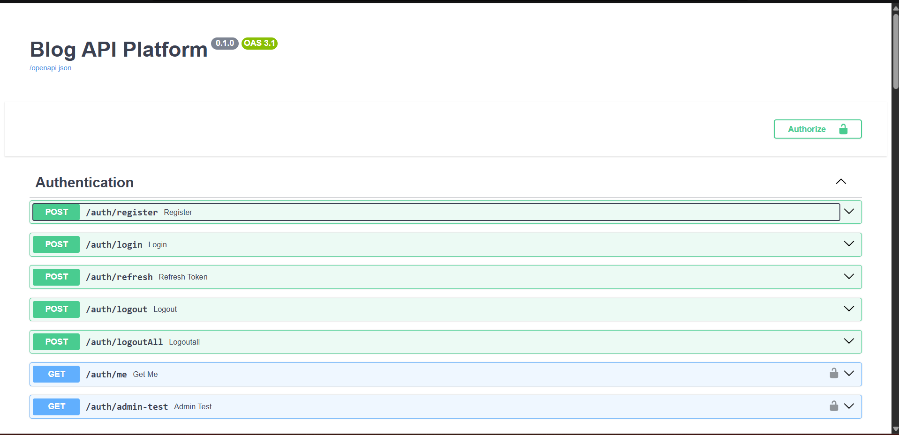
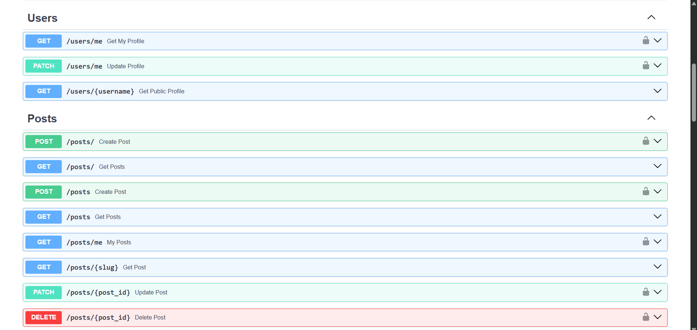
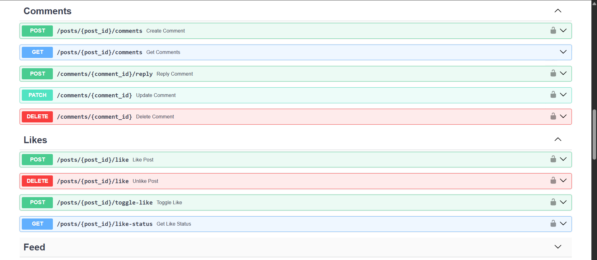

# 🚀 Blog API Platform


A production-ready Blog REST API built with FastAPI following clean architecture principles.

Built to demonstrate backend engineering skills including authentication, authorization, async programming, testing, Docker, CI/CD, and PostgreSQL.

---

# Tech Stack

- FastAPI
- PostgreSQL
- SQLAlchemy 2.0 Async
- Alembic
- JWT Authentication
- Pydantic v2
- Docker
- GitHub Actions
- Pytest
- AsyncPG

---

# Features

## Authentication

- User Registration
- Login
- JWT Access Token
- Refresh Token
- Logout
- Logout All Devices
- Role Based Authorization

---

## Users

- View Profile
- Update Profile
- Public User Profiles

---

## Posts

- Create Post
- Update Post
- Delete Post
- Get Single Post
- Get All Posts
- Get My Posts

---

## Comments

- Create Comment
- Reply to Comment
- Edit Comment
- Delete Comment
- Nested Comments

---

## Likes

- Like Post
- Unlike Post
- Toggle Like
- Like Status

---

## Feed

- Personalized Feed
- Pagination
- Sorting

---

## Testing

- Pytest
- Async Tests
- Database Fixtures
- Authentication Tests

---

## DevOps

- Dockerized
- Docker Compose
- GitHub Actions CI
- Alembic Migrations

---

# Project Structure

```
app/
│
├── api/
├── core/
├── db/
├── models/
├── repositories/
├── schemas/
├── services/
├── dependencies/
├── middleware/
├── utils/
└── main.py
```

---

# API Documentation

After starting the server

```
http://localhost:8000/docs
```

OpenAPI Schema

```
http://localhost:8000/openapi.json
```

---


# Swagger Documentation

## Authentication



---

## Posts



---

## Comments & Likes



# Installation

Clone repository

```bash
git clone https://github.com/Sk2059/BlogAPI.git

cd BlogAPI
```

Create virtual environment

```bash
python -m venv .venv
```

Activate

Windows

```bash
.venv\Scripts\activate
```

Linux

```bash
source .venv/bin/activate
```

Install packages

```bash
pip install -r requirements.txt
```

Create .env

```env
DATABASE_URL=
SECRET_KEY=
ALGORITHM=
ACCESS_TOKEN_EXPIRE_MINUTES=
REFRESH_TOKEN_EXPIRE_DAYS=
```

Run migrations

```bash
alembic upgrade head
```

Run

```bash
uvicorn app.main:app --reload
```

---

# Docker

```bash
docker-compose up --build
```

---

# Testing

Run all tests

```bash
pytest
```

Coverage

```bash
pytest --cov=app
```

---

# CI/CD

GitHub Actions automatically

- Install dependencies
- Start PostgreSQL
- Run migrations
- Execute tests
- Verify build

---

# API Endpoints

| Module | Endpoints |
|---------|-----------|
| Auth | Register, Login, Refresh, Logout |
| Users | Profile CRUD |
| Posts | CRUD |
| Comments | CRUD + Replies |
| Likes | Like / Unlike |
| Feed | Personalized Feed |

---

# Future Improvements

- Email Verification
- Password Reset
- Bookmarks
- Follow Users
- Notifications
- Search
- Tags
- Categories
- Image Upload
- Redis Caching
- Rate Limiting
- Background Tasks
- Deployment (AWS)

---

# Author

**S.K**

Backend Developer

GitHub

https://github.com/Sk2059